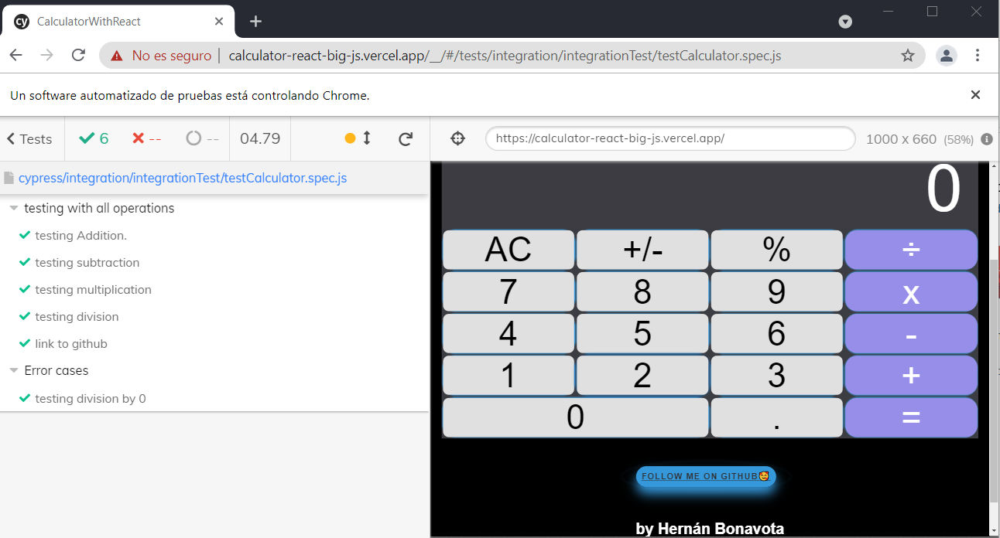

# App React App

# Calculator

Created with 
+ *create-react-app*
+  Big.js library. 

See the [full create-react-app guide](https://github.com/facebookincubator/create-react-app/blob/master/packages/react-scripts/template/README.md).


<p> "Calculator" is a small but effective project in which I use A small, fast JavaScript library for arbitrary-precision decimal arithmetic. 
</p>

# Directions for executing the project


To be able to execute the project correctly, the following indications must be taken into account.
If you have any questions or concerns with the installation you can write to me without problem -> [Here](hbonavota@gmail.com)

# Install

+ It would only be necessary to install the dependencies. Finally you have to go to the /calculator-hooks folder and make the `npm install`.

```
/calculator-hooks (main)
npm i

```

+ Finally, run the process with `npm start` 

```
/calculator-hooks (main)
npm start

```
<div align="center"> </div>


# TESTING CYPRESS -->

+ For de run test with Cypress, run the process with Interface `cypress:open`, or without interface `cypress:run` 

```
/calculator-hooks (main)
npm run cypress:open

```
+ With Interface
<div align="center"> </div>


+ without interface

<div align="center"> </div>
<div align="center"> </div>
___

# Preview on Deploy in Vercel (Desktop) 
See the [Link Deploy in Vercel](https://calculator-react-big-js.vercel.app/).


# Preview on Deploy in Vercel (Mobile)


